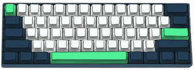

# Emacs Config (init.el)
### Configuration set based on Emacs 29.3

Pre-defined configuration to work with WEB development with:
- PHP
- NodeJS
- React
- TypeScript
- JavaScript
- HTML
- CSS.

The present configurations were made by personal preference, none of the popular bases for emacs were used, such as: Spacemacs, Doom Emacs, etc. But it contains packages that make up the mentioned configurations.
